# School_District_Analysis

## Overview
The purpose of this analysis was to compare school reading and math grades by size of school, budget etc. By doing this the school district could determine how they wanted to go about things for the next school year to maximize student success.

The grades at Thomas High School were tampered with for the 9th grade. The purpose of the challenge was to remove those grades and perform the updated analysis.

## Results

District Summary Before  | District Summary After
:-------------------------:|:-------------------------:
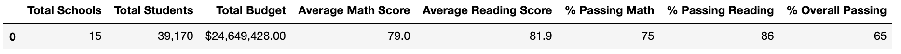| 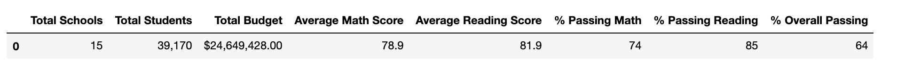

- The district summary shows that the overall pasing percentage dropped only by 1% 
---
School Summary Before | School Summary After
:-------------------------:|:-------------------------:
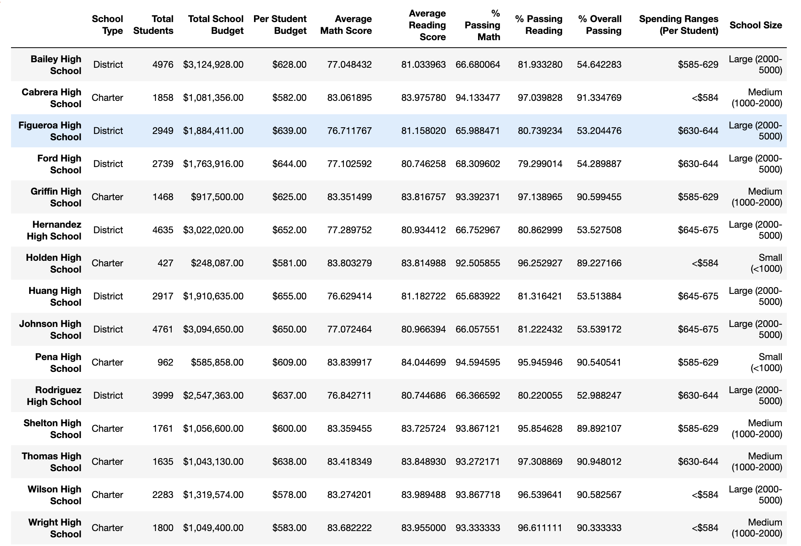| 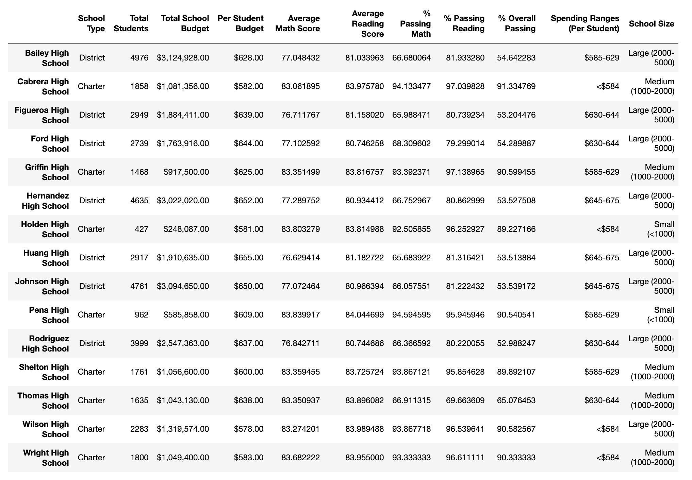

- Because of the grades being switched out, Thomas High Schools overall passing percentage went from 90% to 65%
---
Top 5 Before | Top 5 After
:-------------------------:|:-------------------------:
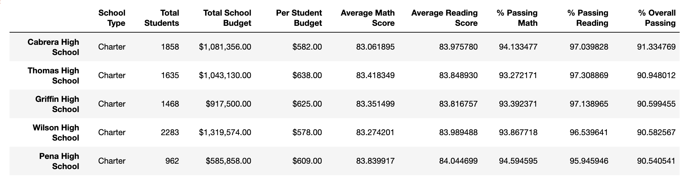| 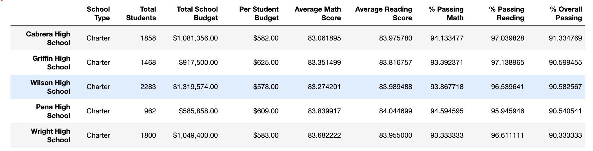

- Thomas High School was bumped down from the 2nd school on top but not low enough to be in the bottom tier.
---
Summary by School Type Before | Summary by School Type After
:-------------------------:|:-------------------------:
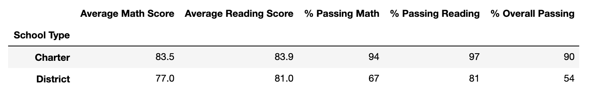| 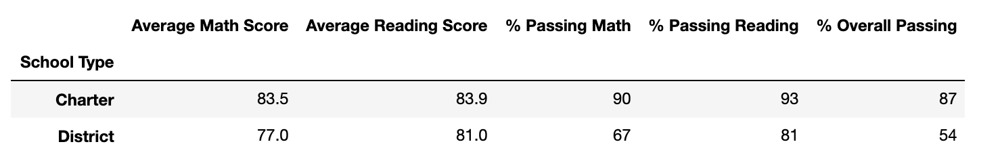

Spending Summary Before | Spending Summary After
:-------------------------:|:-------------------------:
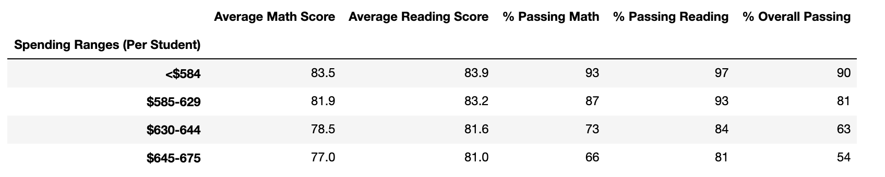| 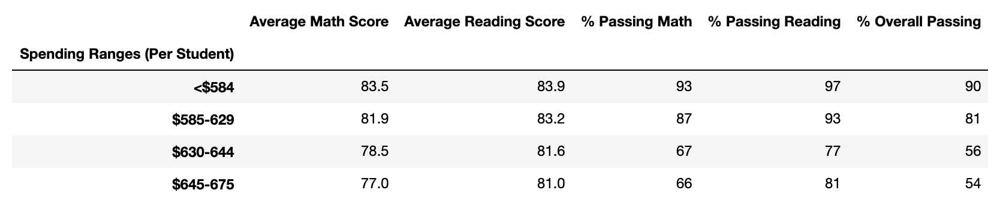

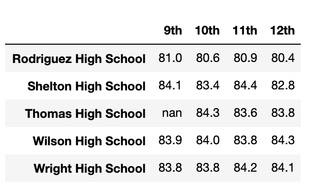

- The overall Charter passing percentage dropped by 3%
- For spending ranges $630-644 per student, the passing percentage dropped by 7%
- The school summary by grade had no major changes besdies the 9th grade scores being marked "nan"

## Summary
After replacing the 9th grade scores at Thomas High School, the major differences are their overall passing percentage dropping 25% and them no longer being apart of the top schools. Another key difference is the percentage drop in one of the spending ranges. The averages for each dataframe were unaffected
